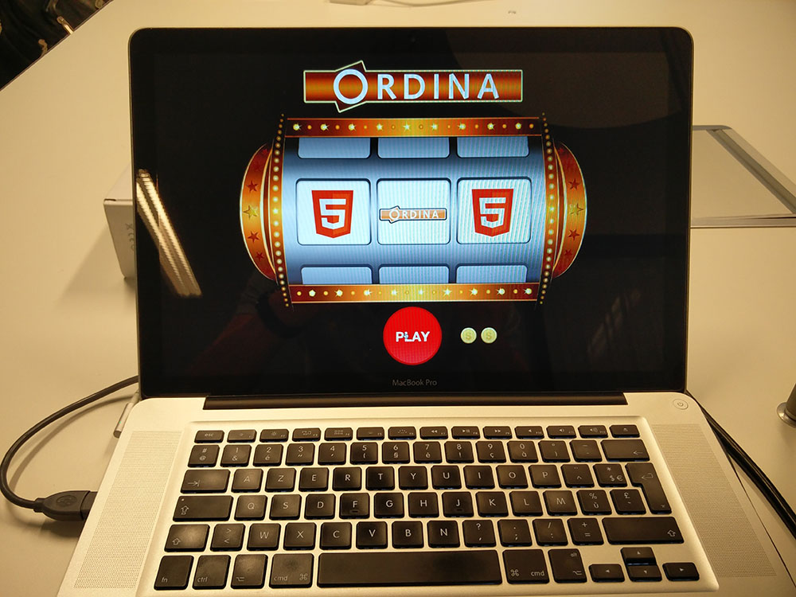
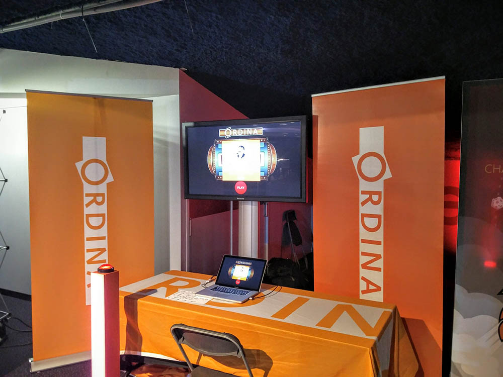

>To showcase end-to-end LoRa applications we built simple yet fun, real world demo applications. 
These applications show a full end-to-end implementation of the LoRa techonology leveraging the Proximus MyThings Internet of Things platform.

  

> The Booze-o-meter V2 at Devoxx Belgium 2016.

# Building end-to-end LoRa Iot Solutions 
Building an enterprise IoT solution is challanging. Devices need to be enrolled, monitored and maintained. 
You can roll your own network and handle all of this yourself, this however will require quite the backend system to facilitate all of this.
The Proximus LoRa network in combination with their MyThings platform takes away most of this and allows us to focus on the actual applications.

## Technologies overview
For our rapid prototypes and small to medium applications we have chosen the following technical stack:
- Proximus LoRa network for LoRa connectivity
- Proximus MyThings platform for device management
- NodeJS for the backend with TypeScript for the backend
- Angular for the frontend (The older versions are still on AngularJS)

Below we will go into detail about each item shortly

  

### LoRa

LoRa, short for LoRaWAN is a LPWAN (Low Power Wide Area Network) meant for wireless battery powered devices of 'things'.
It offers a low power, low bandwith secure network to transceive information across large distances. The network is layed out in star topology and can easily be extended by placing more base stations also called LoRa gateways.

Some network parameters:
- Range of 5 to 15 kilometers (3,1 to 9,3 miles) depending on the conditions and signal strenght.
- Data rate of 0,3 kbps to 50 kbps

More detailed information and the full specifications can be found on the [LoRa Alliance website](https://www.lora-alliance.org/technology).

  

### Proximus MyThings 

[Proximus MyThings](https://mythings.proximus.be/#/login/) is a LoRa device onboarding and management platform. 
It is used to enroll devices and sensors, to map their data to specific endpoints and provide tools for device management.

The platform consists of three main parts:
- MyThings Builder: Charts and sensor values (containers)
- Mythings Manager: Online device onboarding and user management
- MyThings Scanner: Offline (in the field) device onboarding

  

### Node.js &amp; TypeScript

Most people should be familiar with [Node](https://nodejs.org/en/).
It is the JavaScript runtime built upon the V8 engine that Google Chrome uses.
It is a lightweigth and efficient runtimle that uses an event-driven, non-blocking I/O model.
This combined with the added type safety that TypeScript provides makes this an excellent choise for rapid prototyping.

Some of our own demo applications make use of the Node Simple Server (NSS) application, while other just use express. This depends on the needs of the project.
If you are interested in the NSS project, we have a blogpost about it [here](http://ordina-jworks.github.io/iot/2017/01/21/Node-with-TypeScript.html) and it is [on github](https://github.com/ordina-jworks/NodeSimpleServer) too!

  

### Angular

Like with Node, most people should be familiar with [Angular](https://angular.io) (or the older AngularJS).
Angular is a development platform for building modern single page web applications.
It is a complete rewrite of the older AngularJS and therefor has some big changes in how things work.
Angular is easy to set up and use, it also is fully cross platform/browser compatible.

## Our demo applications
All our demo applications are publicly available in the [github project of NSS](https://github.com/ordina-jworks/NodeSimpleServer).
These demo application are ever evolving as we are currently porting them from the older AngularJS to Angular with TypeScript.

Our demo applications have been showcased and used at several events including internal Proximus events as well as conferences like Devoxx, Techorama and The Belgian IoT convention in Mechelen.

Below we will go into detail about each application and how it came to be, as well as the iterations they went through.

### The slotmachine
The slotmachine application does mostly what its name suggests, but with a twist.

The idea is simple:
A simple push button sends a signal to the backend application. 
The application dispatches an event via a websocket to the frontend application which turns the slotmachine. 
The slotmachine can either result in a win or a loss. A maximum of three attempts are possible per player, after which a new user registration is required to play again.
The user registration can be disabled depening on de requirements of the event/conference.

The light effects are also controlled by the application. 
If the user has registered the gentle fading switches to a running light effect and if the user wins the effect changes to a set of blinking colors!
The effects are controlled the same way the button is controlled but in the oposite direction. 
The frontend application sends a websocket event to the backend application which controlles the Arduino and the LEDs.

  
  

#### V1
The first version was not LoRa enabled and used a push button and Arduino integration via Johnny-Five to allow interaction. This meant that an Arduino always needed to be connected to the server or laptop that was used as a server.

  

> The Slotmachine V1 at Devoxx Belgium 2015.
 

#### V2
The second version of the slotmachine application swapped out the Arduino and the required wired connection with a LoRa enabled push button.

This allowed us to demonstrate the capabilities of the LoRa network in a fun and engaging way.
The application remained unchanged for the user, and was adapted to be more configurable:
Setting a win chance (up to 100%) and different images/styling for different events.

### The booze-o-meter

  

  

#### V1

#### V2

### The future of our demo applications

## Conclusion

TODO:
<iframe width="560" height="315" src="https://www.youtube.com/embed/BbnwrvfozUs?rel=0" frameborder="0" allowfullscreen></iframe>