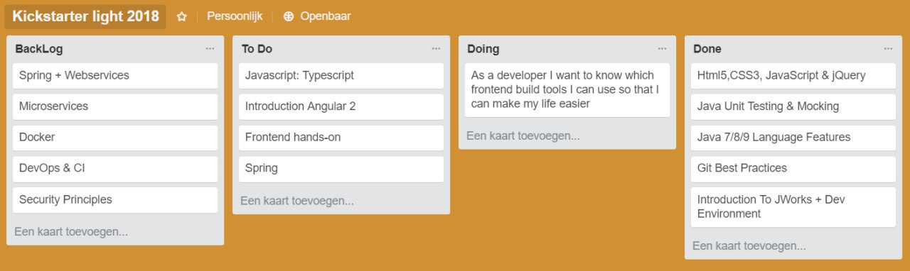

> As a developer I want to know the IT landscape so that I can orientate and implement business value on various fields.” We do this by learning from experts and eagerly absorbing knowledge. Ordina happens to provide the perfect way of doing this by enrolling new employees in their “Kickstarter program”. During this three-week iteration we increased our value by familiarizing ourselves with the Ordina stack.

#Backlog

<!--TODO fix-->

<!-- -->

<!--  -->

<!--inleiding start opleiding (Maarten) -->

#What we have done

## Git <!-- Sam -->

## Backend

### Spring and Spring boot <!-- Johan -->

### Microservices <!-- Yen -->

### Unit testing and mocking <!-- Dries -->

## Frontend

### Essentials <!-- Sam --> 

### Build Tools <!-- Yunus --> 

### Angular <!-- Sam --> 

## DevOps

### CI/CD <!-- Yunus -->

## Security <!-- Johan --> 

## Docker <!-- Nick --> 

#Recap <!--Everyone -->

Nu we klaar zijn met al deze onderwerpen, ieder van ons heeft er uit geleerd:

Per persoon (richtlijn 3 à 4 lijnen):

Nick: “… “ 

Someone else: “ … “

